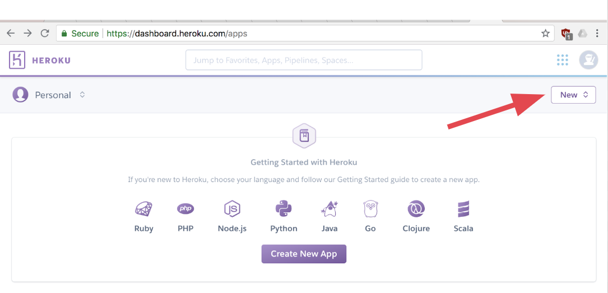
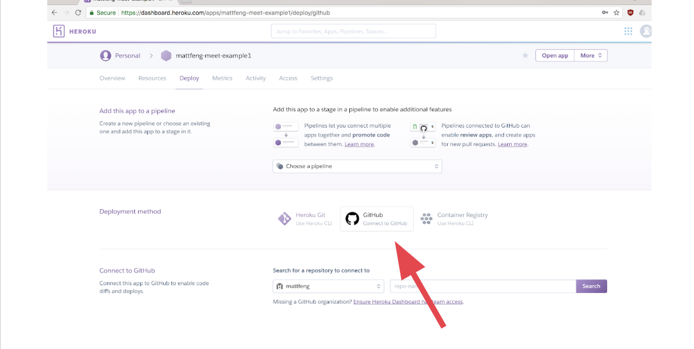
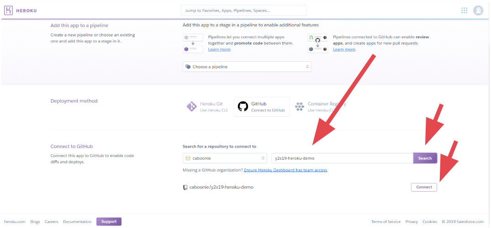
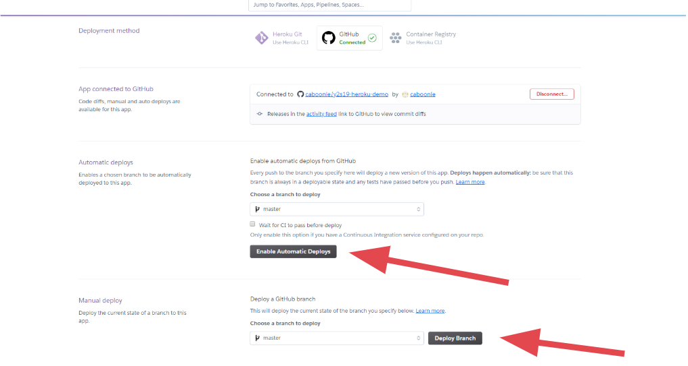
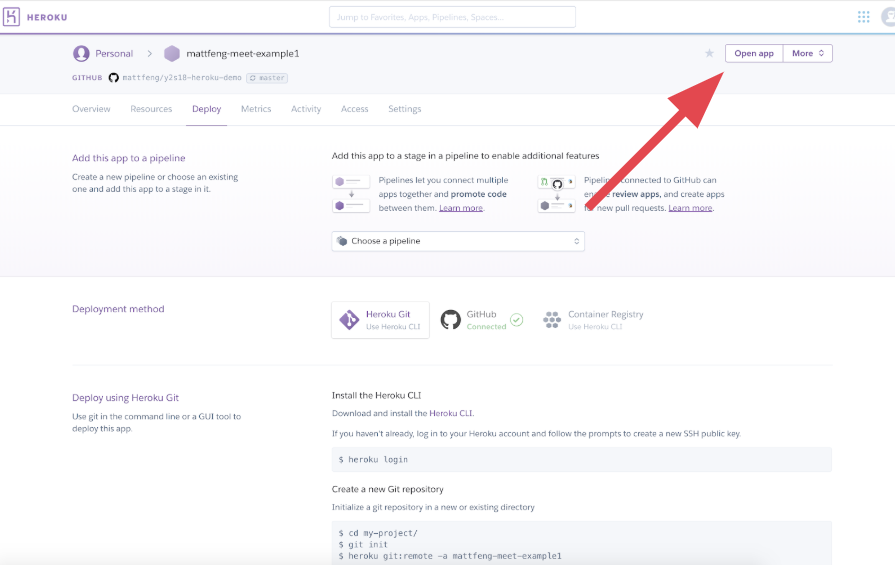

# y2s19-heroku-demo

## Create/sign-in to your heroku account and click `new` and `Create new app`
 
## Give your project a unique name and click `Create app`
## Under Deployment method (how heroku will find your project's code), click `GitHub`
 
## Search for the right repository `y2s19-heroku-demo` and click `Connect`
 
## Click on `Enable Automatic Deploys` so that whenever you update your repo, it will update the heroku site. Then click `Deploy Branch` to deploy it the first time.
 
## Wait until it finishes Deploying and then open the app!
 